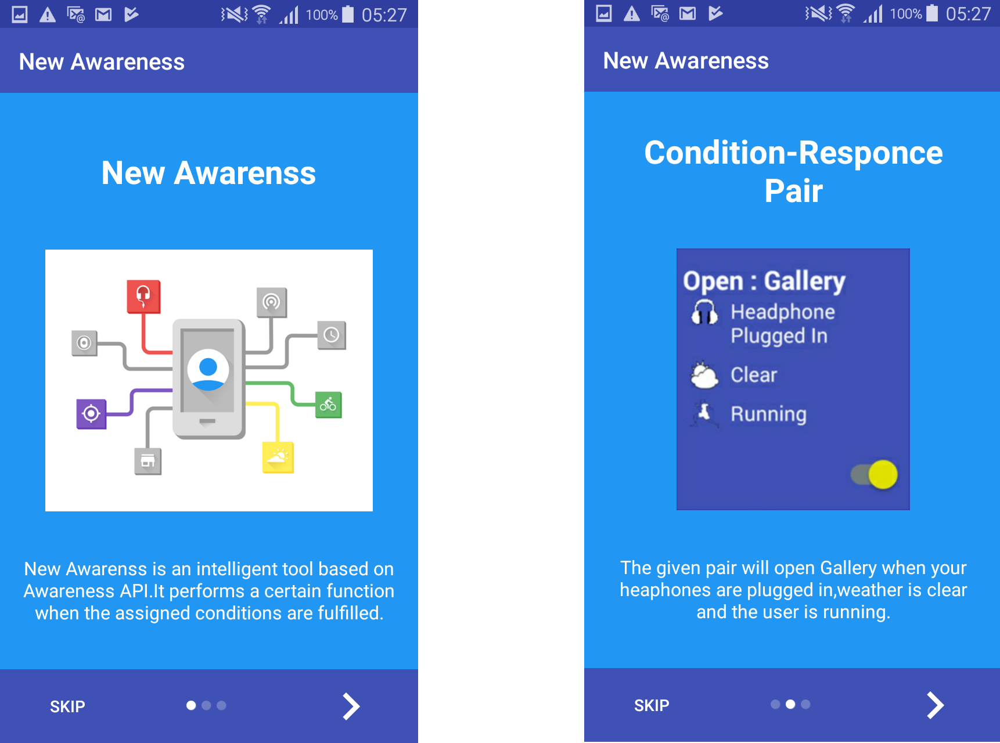
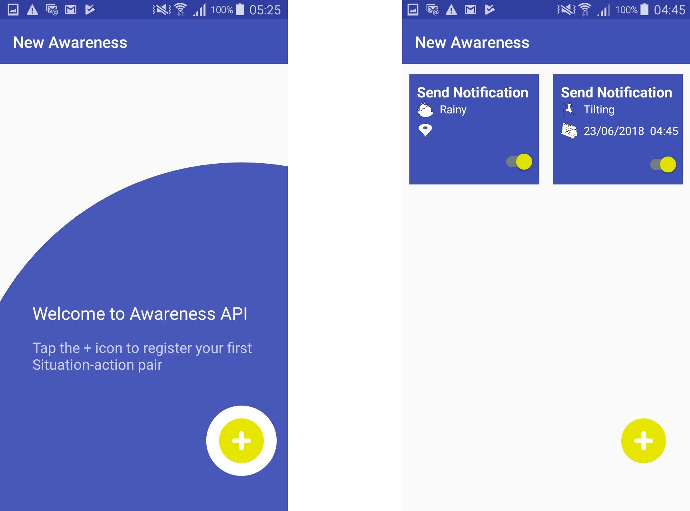
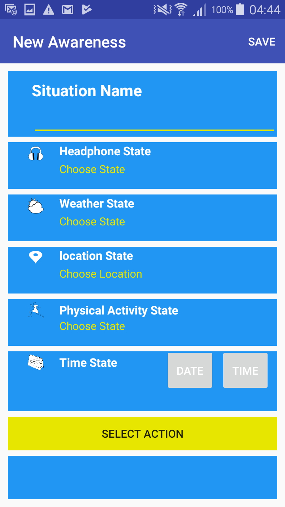

# New Awareness
Taking the Mobile Activity awareness to the next level. Make your mobile do things according to your desired situation response pair.

  

- Send you a notification if it is raining outside So you dont forget your umbrella.
- Inform you when are just a few meters away from your destination.
- Play your desired music player app when you attach your headphones.
- Notifies you if you have spend more than your desired time in a given location.
- Open your Info Blog exactly at your tea time and much more.

##  Motivation
A part of my learning at my first job, Google awareness API. 
I developed this application  to practice my android development skills with the aim to try new libraries, 
architechture patterns and design ideas.

## Services Employed

- Google Awareness API
- Geolocation API
- AppIntro API
- Realm Database
- Material tap target library

 ##To use it
 
 
- Retrieving data from Play Services API and Google Awareness API key.
- To use it is necessary to store them in your Gradle.Properties(project Properties) location.
  - google_play_services_key=your location key
  - google_awareness_key=your awareness key
